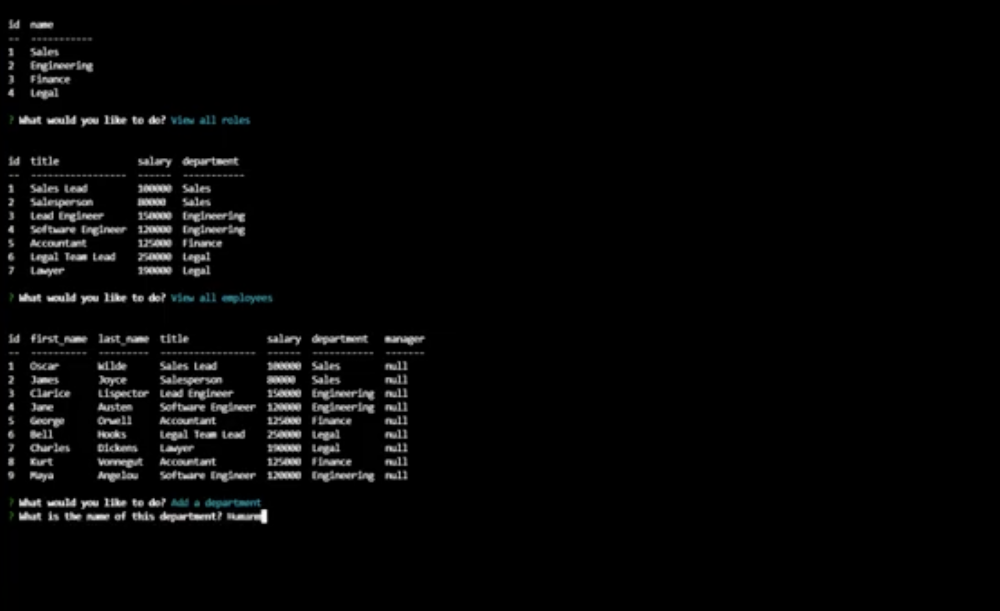

# where-are-my-employees-ohya

## Table of Contents:

- [Description](#description)
- [Questions](#questions)

### Description

I created a command-line application from scratch to manage a company's employee database, using Node.js, Inquirer, and MySQL.  

video link: https://screencast-o-matic.com/watch/c3nrfpVbuen

The following images shows the web application's appearance and functionality:  

### Questions?

- Check out my [Github](https://github.com/sabrtraveler).
- Reach me by email at shareefrossetti@gmail.com
